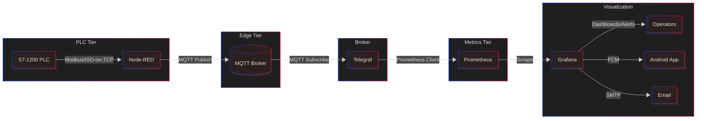

# HVAC Insight: Real-Time HVAC Monitoring via PLC and MQTT

A Kotlin-based mobile monitoring system for Heating, Ventilation, and Air Conditioning (HVAC) infrastructure. This solution integrates Siemens PLCs with an MQTT communication stack, real-time dashboards via Grafana, and automated alerts for critical system metrics.

## 📱 Mobile Application

- **Language**: Kotlin
- **Architecture**: MVVM
- **UI Toolkit**: Jetpack Compose
- **Notifications**: Firebase Cloud Messaging (FCM)
- **Backend Sync**: MQTT Subscriptions via Broker

## 🔌 System Architecture Overview
## High-Level Architecture of the HVAC Insight Monitoring System
A diagram illustrating the data flow from PLC → IOT2050 Gateway (Node-RED) → MQTT Broker → Telegraf → Prometheus → Grafana & Android App.



## 🔧 MQTT Topics Structure

All published topics use the following format:

```
ctrm/melaka/building6/hvac/nitrogen_plc/{sensor_type}_{id}/pv_value
```

Examples:

* `tt_01`, `tt_02` for temperature
* `pt_01` for pressure
* `lt_01` for level
* `ft_01`, `ft_02`, `ft_03` for flow

## 🧰 Technologies Used

| Component          | Tool / Tech                   |
| ------------------ | ----------------------------- |
| PLC Communication  | Siemens S7-1200               |
| Edge Gateway       | SIMATIC IOT2050 with Node-RED |
| Messaging Protocol | MQTT (Mosquitto Broker)       |
| Data Collector     | Telegraf (MQTT Input Plugin)  |
| Time-series DB     | Prometheus                    |
| Visualization      | Grafana                       |
| Notifications      | Email + FCM Push              |
| Mobile Frontend    | Kotlin + Jetpack Compose      |
| Web Dashboard      | Grafana Embedded View         |

## 📦 Setup

### 1. PLC & Node-RED (Edge)

* Configure DB12 in TIA Portal to include sensor addresses.
* Use Node-RED flows to read and publish sensor data over MQTT. See: `Node-RED flows.json`

### 2. Telegraf Configuration

Configure MQTT consumer to listen to all `ctrm/melaka/building6/hvac/nitrogen_plc/#` topics.
Example:

```toml
[[inputs.mqtt_consumer]]
  servers = ["tcp://mqtt.ctrm.com.my:1883"]
  topics = ["ctrm/melaka/building6/hvac/nitrogen_plc/#"]
  data_format = "json"
  topic_tag = "topic"
```

### 3. Prometheus Scraping

Ensure `prometheus.yml` includes:

```yaml
- job_name: 'telegraf_mqtt'
  static_configs:
    - targets: ['telegraf:9273']
```

### 4. Grafana Alerts

* Set up threshold alerts for TT, LT, PT, and FT sensors.
* Integrate FCM via webhook.

### 5. Mobile App (Android)

* Clone this repo and open in Android Studio.
* Set up `google-services.json` for Firebase notifications.
* Run the app on device or emulator.

## 📊 Dashboard Preview


## 📅 Gantt Chart

Project timeline and deliverables are illustrated in the following:


## 📄 References

This project is supported by studies on HVAC IoT systems and MQTT integration. For a complete list, see [HVAC Insight - References.docx](./HVAC%20Insight%20-%20References.docx).

## 📃 License

This project is part of academic research for the Master of Computer Science (Mobile Software Development) at Faculty of Information Technology & Communications (FTMK) Universiti Teknikal Malaysia Melaka (UTeM).

